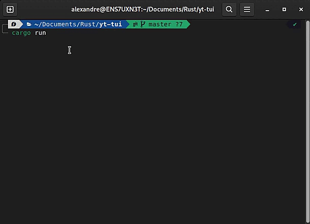

# TUI-Youtube-Music-Player

A terminal based app to listen to music from youtube (WIP)

## Introduction

This program wants to be a simple youtube music player living inside the terminal. I'm trying to avoid third-party software such as the great ffmpeg or youtube-dl.

This means I probably have to build some workarounds in order to get the same features. Actually getting links from youtube, just like youtube-dl, is a question of sending a post request to a specific URL.

> **/!\\ Warning:** the first launch of the apps redirects to a google OAuth page, it's necessary for me to work without using an API key, as of now only some account may use this API (I am waiting for my API to be published by google)

## Status

I am waiting on the [following issue to be solved](https://github.com/probablykasper/redlux/issues/4) (probablykasper/redlux#4) as I cannot decode the .m4a file provided by YouTube.

## ToDo

-   [x] Implement a simple UI using [tui-rs](https://github.com/fdehau/tui-rs)
-   [x] Get audio links from YouTube without youtube-dl
-   [ ] Decode .m4a audio
-   [ ] Play audio from the terminal
-   [ ] Build player controls
-   [ ] Make the search box into a popup
-   [ ] Link the account's playlist to the application
-   [ ] Song suggestion
